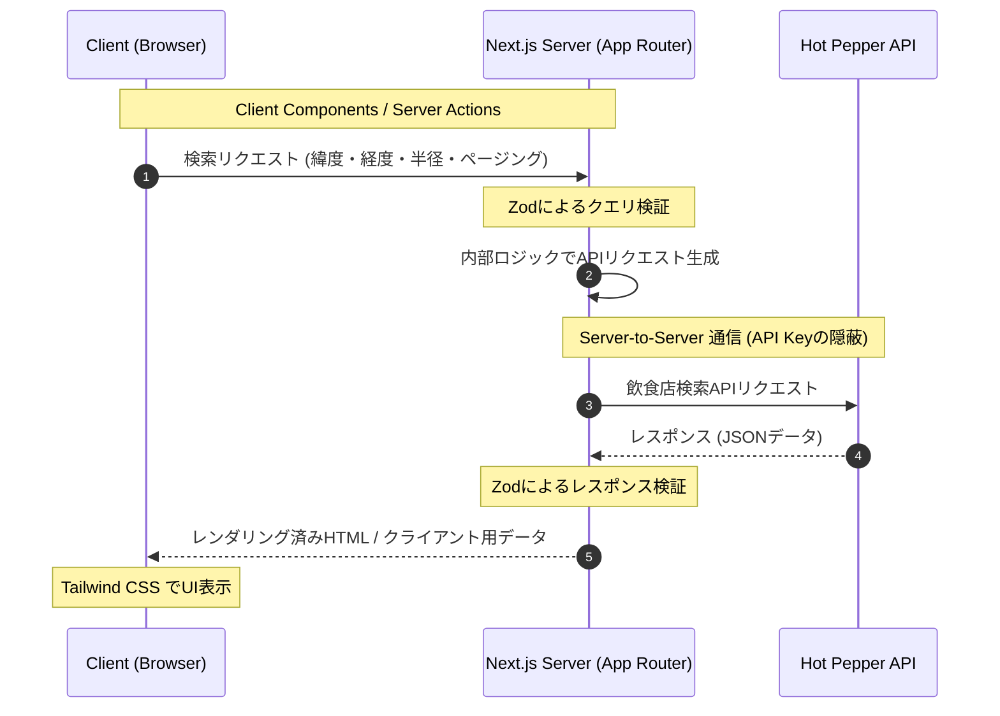

# 簡易仕様書

## 概要

### 作者
川野 稜介

### アプリ名
たこるーと

### コンセプト
近くのたこ焼きがすぐ見つかる

### 開発期間
6日間

### 公開したアプリの URL
https://takoroute.vercel.app

### リポジトリ URL

https://github.com/nrysk/takoroute

## 環境

### 開発環境

| | バージョン |
| --- | --- |
| macOS | 26.2 (25C56) |
| VSCode | 1.118.1 |
| node | v24.15.0 |

### 開発環境の構築手順

- node (v24.15.0) を使用します
- `.env.local`にホットペッパーグルメAPIのキーを設定

  ```.env.local
  HOTPEPPER_API_KEY=XXXXXXX
  ```

- 開発用サーバーを立てます
  - `npm run dev`
  - `localhost:3000`にアクセスします
- ビルド確認
  - `npm run build && npm run start`

### 動作確認環境

- Android Chrome
- MacOS Chrome
- MacOS Safari

### 開発言語

- TypeScript (Version 5.9.3)
- HTML
- CSS

### ライブラリと選定理由


- NextJS
  - サーバーコンポーネントにより、データの取得と表示を同一コンポーネントで完結させることができる点。フロントエンドとバックエンドにおいて型の共通化やAPIキーの隠蔽が容易に行える。
  - ファイルベースルーティングにより、ディレクトリ構造に悩む必要が無い点。ユーザーに情報を伝えるためのNotFoundやローディング画面の作成が容易であり、一貫性を保ちやすい。
  - 重複するリクエストのキャッシュが行える点。店舗検索という特性上、APIリクエストに時間的な局所性があり、キャッシュが有効であると考えている。
  - Vercelへのデプロイを前提とすることで、インフラ構築のコストをほぼ無くせる点。特にPR単位でのプレビューは常に動作可能な状態に役立つ。
- TailwindCSS, CVA
  - HTML構造とスタイルを同じ箇所に記述できる点。ファイルの移動を減らすことで認知負荷が低減できていると感じている。
  - 簡単に定義済みのクラスとして色やサイズを使用できる点。CSS変数を跨がないので意識すべきことを減らせると感じている。
  - CVA: Tailwindのゴチャつくユーティリティクラスを共通化できる点。UIのバリエーションをスキーマ化することで、可読性が向上し、型補完の恩恵を受けられる。
- Zod
  - 実行時に型安全を確保できる点。
    - 外部APIのレスポンスを厳密に検証することで、アプリ内部に壊れたデータが入り込むことを防止できる。欠損値に対して、`default()`や`catch()`を用いてフォールバックすることで、ランタイムエラーを回避する事ができる。
    - クエリパラメーターの必須引数・任意引数をスキーマで一元管理できる。これにより、誤ったURLに対して適切にエラーハンドリングできる。ミスしがちな文字列変換や値の検証も容易になる。
- Biome
  - LinterとFormatterが集約しており、ゼロコンフィグで動作する点。環境構築にかけるリソースを、機能実装に当てられると考えた。
  - 反省点：TailwindCSSとの親和性を過小評価していた。具体的には、クラス名のソートやタイプミス検出において、ESLintの方が優れている。

### 設計ドキュメント



しっかりした設計ドキュメントは未作成ですので、設計方針と設計メモについて述べます。

#### 1. APIの調査

ホットペッパーグルメサーチAPIの[調査用リポジトリ](https://github.com/nrysk/takoroute-exp)を作成し、特徴を調査しました。

ここでは、APIのレスポンスの構造や型、欠損値の有無やレートリミットなどについて確認しました。

#### 2. 簡易デザインの作成

Figmaを使用し、簡易的な画面を作成しました。

完璧なデザインではなく、思考整理と後戻りを防ぐための設計図として活用しました。
結果的にこのデザインは使用しませんでしたが、プロトタイピングを通して手戻りの少ない開発ができたと感じています。


#### 3. タスクの割り出し

[GitHub Project](https://github.com/users/nrysk/projects/4/views/1)のKanbanを活用し、TODO/InProgress/DONEでタスク管理を行いました。

事前に割り出したタスク以外にも、開発中に気づいたことを記述することで、抜け漏れを防ぐことを意識しました。また、`タスク->Issue->PR->CICD`の一連の流れを意識することで、効率的に開発を進められたと感じています。


## アプリケーション機能
### 機能一覧

- たこ焼き検索： ホットペッパーグルメサーチAPIを使用して、現在地周辺のたこ焼き屋を検索する
- たこ焼き情報取得： ホットペッパーグルメサーチAPIを使用して、たこ焼きやの詳細情報を取得する

### 画面一覧

- 検索画面 `/search`：
  - 現在地からの距離を指定して、たこ焼きを検索する
- 一覧画面 `/search/results`：
  - 検索結果を一覧で表示する
- 詳細画面 `/shops/[id]`
  - 店舗の詳細を表示する

## こだわったポイント
### デザイン面

始めは、独自の装飾や配色を試みましたが、主観的なデザインは一貫性がなく、時間の浪費を招きました。

そこで、たこ焼きに抱くイメージを言語化するために、既存のサイトを調査しました。
その結果、以下の2点が分かりました。

- 藍色や朱色などの伝統的な配色
- 和紙のテクスチャを使用した背景

これにより、デザインの意思決定がまとまり、迅速な再デザインを行う事ができました。

### アドバイスして欲しいポイント

#### 1. ユーザーの復帰導線について

今回の開発では、ユーザーが迷子にならないことを意識しました。
具体的には以下のポイントです。

- 通信エラーが発生した際に500ページを表示する。このページから検索ページに戻れるようにリンクを配置する
- 詳細画面で店舗IDが存在しない場合に、404ページを表示する。このページから検索ページに戻れるようにリンクを配置する。
- 検索一覧ページのクエリパラメーターに不正があれば、検索ページに戻す。

抜け漏れがないように調査しましたが、これ以外で実装すべきポイントはありますか？

また、エラー内容はエラーコードではなく、ユーザーに伝わるようなメッセージにすべきと講義で習いました。
ただ、通信エラーは専門的な部分にもなるので、ユーザーにどう説明すると丁寧なのか知りたいと思いました。


## 今後実装すべき機能

- [ ] ログイン機能を実装する
- [ ] たこ焼きのレビューをメモし、見返せるようにする
- [ ] マップ上で周辺のたこ焼きやを確認できるようにする


## 自己評価

### 技術的達成度

普段の開発では、目的を達成するためにの機能だけを作ることが多かったです。
今回の開発では、ユーザーが使った場合に起こりえる事象を考慮して行った点が新鮮でした。

特に、Zodを使ったクエリパラメーターの検証を学べた点で満足しています。

### 開発プロセス

コーディングテストという限られた時間の中で、効率的な開発に挑戦しました。
Figmaを使ったプロトタイピングやGithub Projectを使ったタスク管理を行い、ツールを使った思考整理の重要性を学べた点で満足しています。
